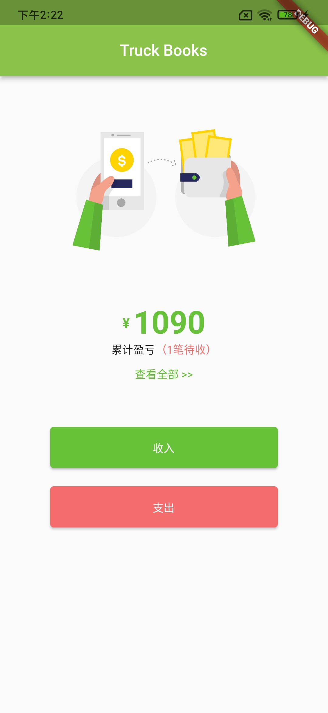

这是一款基于 T1 后端云打造的货车司机记账软件，其中使用了 T1 后端云聚合查询接口统计收入、支持总笔数、收入、支出总金额、净利润计算、记账、查看账单等功能，目前该 App 仅供参考，部分功能还未开发。

## 使用

### 克隆代码

```shell
git clone git@github.com:t1ykf/truck_books_app.git
```

### 获取依赖

```shell
flutter pub get
```

### 修改配置

修改 lib/config.dart 中的 Application ID、API Key、Secret Key 等信息。

```dart
final String domain = "https://dev.t1y.net/api"; // 您已备案的域名
final int appId = 1001; // 您的Application ID
final String apiKey = "2c6118c4e02b40fe96f5c40ee1dc5561"; // 您的API Key
final String secretKey = "650bd657da0243b282d9cab6d75a80ff"; // 您的Secret Key
final String table = "logs"; // 记账数据存在的表名
```

### 运行

```shell
flutter run
```




## 聚合查询

### 请求

使用 `http` 库构造 T1 后端云聚合查询请求，查询收入、支出总笔数，收入、支出总金额等等。

```dart
void getMoney() async {
    var timestamp = DateTime.now().millisecondsSinceEpoch ~/ 1000;
    var headers = {
      'X-T1Y-Application-ID': T1YClient().appId.toString(),
      'X-T1Y-Api-Key': T1YClient().apiKey,
      'X-T1Y-Safe-NonceStr': generateMd5(timestamp.toString()),
      'X-T1Y-Safe-Timestamp': timestamp.toString(),
      'X-T1Y-Safe-Sign': generateMd5('/v5/classes/' +
          T1YClient().table +
          '/aggregate' +
          T1YClient().appId.toString() +
          T1YClient().apiKey +
          generateMd5(timestamp.toString()) +
          timestamp.toString() +
          T1YClient().secretKey),
      'Content-Type': 'application/json'
    };

    var request = http.Request(
      'POST',
      Uri.parse('https://dev.t1y.net/api/v5/classes/' +
          T1YClient().table +
          '/aggregate'),
    );

    // 构造T1后端云聚合查询结构体
    request.body = json.encode([
      {
        "\$group": {
          "_id": "\$settle",
          "totalFare": {"\$sum": "\$fare"},
          "totalOutMoney": {"\$sum": "\$out_money"},
          "count": {"\$sum": 1}
        }
      },
      {
        "\$project": {
          "type": "\$_id",
          "totalAmount": {
            "\$add": ["\$totalFare", "\$totalOutMoney"]
          },
          "totalFare": 1,
          "totalOutMoney": 1,
          "count": 1,
          "_id": 0
        }
      }
    ]);

    request.headers.addAll(headers);

    try {
      final response = await http.Client().send(request);
      if (response.statusCode == 200) {
        final responseBody = await response.stream.bytesToString();
        print(responseBody);
        Map<String, dynamic> jsonMap = json.decode(responseBody);
        setState(() {
          money = jsonMap['data']['data'][1]['totalAmount'] -
              jsonMap['data']['data'][0]['totalAmount']; // 总收入减去总支出得到净利润
          settle = jsonMap['data']['data'][0]['count']; // 支出笔数统计
        });
      } else {
        // 聚合查询失败（code不等于200）
        print(response.reasonPhrase);
      }
    } catch (error) {
      // 网络错误等原因
      print("Error: $error");
    }
  }
```

### 响应

其中 data 数组中的第 0 位元素 type 为 false 的为支出，第 1 位元素 type 为 true 的为收入，`count`为收入或支出的总笔数，`totalOutMoney`为垫付成本，`totalFare`为运费，`totalAmount`为所有数据的垫付+运费总和（累计收入或支出）。

```json
{
  "code": 200,
  "data": {
    "data": [
      {
        "count": 1,
        "totalAmount": 160,
        "totalFare": 150,
        "totalOutMoney": 10,
        "type": false
      },
      {
        "count": 1,
        "totalAmount": 1250,
        "totalFare": 250,
        "totalOutMoney": 1000,
        "type": true
      }
    ]
  },
  "message": "ok"
}
```

其中还包括分页查询、添加数据等，有需要请自行了解代码。
